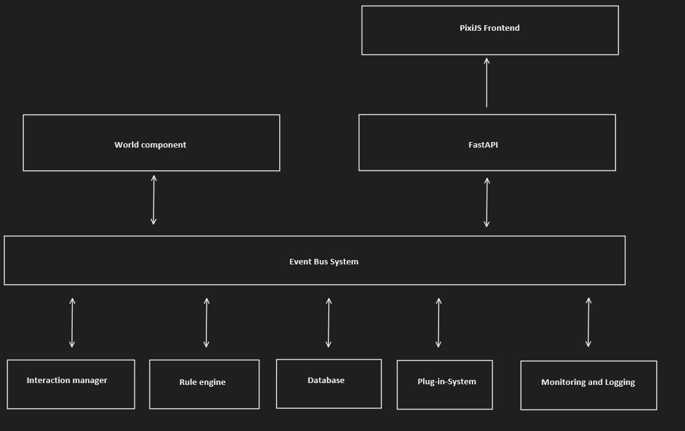

# EvoWorld

## Overview

This project aims to create a 2D world simulation with a focus on evolutionary behavior and neural networks. The simulation is built using FastAPI for the backend and PixiJS for the frontend. The architecture is designed to be modular, scalable, and extensible.

## Components

### World Component

The World Component is the core of the simulation. It manages the state of the world and coordinates the interactions between entities.

### Interaction Manager

This component is responsible for handling interactions between entities, such as collisions or resource gathering.

### Rule Engine

The Rule Engine defines the rules and conditions that govern the behavior of entities and the dynamics of the world.

### Evolution Engine

The Evolution Engine is a new component responsible for managing the evolutionary aspects of the simulation. It evaluates the "fitness" of each entity and evolves their neural networks over generations.

### API Interface (FastAPI)

The API Interface provides endpoints for fetching the current state of the world and potentially manipulating it.

### Frontend (PixiJS)

The frontend is built using PixiJS and provides a real-time visualization of the simulation.

### Monitoring and Logging Module

This module is responsible for capturing important metrics and events for later analysis.

### Data Persistence Module

This module handles the storage of the world state and entities for later analysis or resumption of the simulation.

## How to Run

The code is still building up
